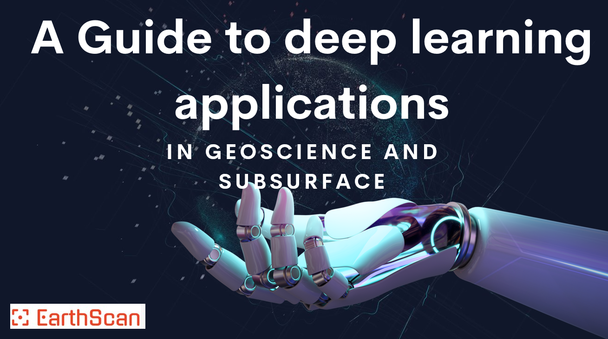
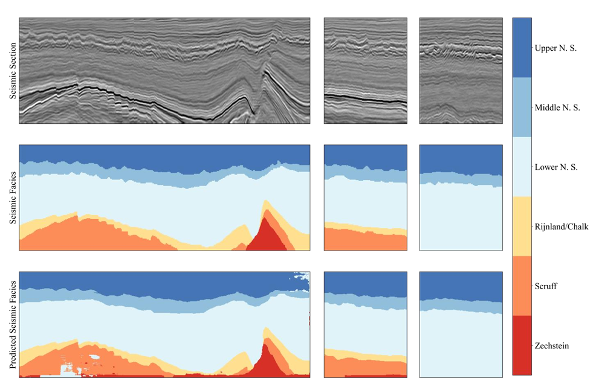

# EarthScanWebinar
Repository for all the reference materials talked about in EarthScan Webinars along with additional resources

Welcome to our GitHub Page.

Here are few topics that we'll be covering in the coming webinars.

- Well Correlation

Reference: Well-to-well correlation and identifying lithological boundaries by principal component analysis of well-logs

- Seimsic Facies Analysis

Reference: Seismic Facies Analysis: A Deep Domain Adaptation Approach 

- Well Log Digitization using Artificial Intelligence
