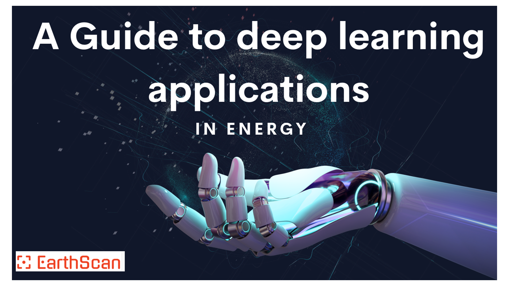

<!--- ---> 

# Awesome Geology & AI Webinar with Code 👇  
> Repository for all the reference materials talked about in EarthScan Webinars along with additional resources

Table of Contents

- [About](#about)
- 

    
<a href="#explore-the-cutting-edge">Explore the cutting-edge</a>

    <ul>
      <li><a href="#webinar-1">Webinar 1: A Guide to deep learning applications in GEOSCIENCE and SubSurface</a></li>
    </ul>
    <ul>
      <li><a href="#webinar-2">Webinar 2: Unlocking the Power of Data - W2W Correlation, Exploration, and Augmentation Techniques</a></li>
    </ul>
    <ul>
      <li><a href="#webinar-3">Webinar 3: The Science and Art of Well-to-Well Correlation - Architecture Design, Modeling & Training Pipeline</a></li>
    </ul>
    <ul>
      <li><a href="#webinar-4">Webinar 4: Advanced Machine Learning Techniques - Transformer Model, Hungarian Matcher and DETR Model</a></li>
    </ul>
    

- [Additional Resources](#additional-resources)
- [Support](#support)

---

## About

  

<table>
<tr>

The EarthScan webinars are designed to share our knowledge and expertise with the broader data science community. Through a series of interactive sessions, attendees will learn about the latest developments in machine learning and artificial intelligence as applied to geoscience, as well as best practices for data exploration and analysis. Our goal is to provide attendees with the tools and knowledge they need to take their research and projects to the next level.

Webinars will be held every **two weeks**, and all codes and materials will be made available on GitHub. We welcome attendees from all backgrounds and levels of experience, and look forward to fostering a community of geoscience professionals working at the forefront of technology.

Discover the latest advancements in AI and ML applied to geoscience with our upcoming webinars covering:

- *Machine learning and artificial intelligence applied to geoscience*
- *Exploration and analysis of geoscientific data*
- *Techniques for data augmentation and preprocessing*
- *Machine learning pipeline design and implementation*
- *Advanced machine learning models and their applications*
- *Guest speaker sessions on current research and industry developments*
- *Tools and technologies for data visualization and model deployment.*
  

</tr>
</table>
  
---

## Explore the cutting-edge

<table>
<tr>

  
In this section, attendees will have an overview of the topics that will be covered in the upcoming webinars. These topics will cover the latest advancements in the field of AI and ML applied to geoscience, including techniques for data exploration and analysis, data augmentation techniques, machine learning pipeline design and implementation, advanced machine learning models and their applications, guest speaker sessions on current research and industry developments, and tools and technologies for data visualization and model deployment.
  

</tr>
</table>

---
## WE ARE NOW ACCEPING BETA TESTERS FOR OUR ES RASTER DIGITIZER TOOL

###  Webinar 1: A Guide to deep learning applications in GEOSCIENCE and SubSurface 

<table>
<tr>

| Agenda | #Links     | 
| :---:   | :---: |
|
Discussed the application of AI and ML in the field of Energy. Our goal was to help attendees understand the potential of AI in the geoscience industry and provide them with the tools and knowledge to research, develop and deploy their own deep learning applications.
| <li><a href="https://github.com/deepkapha/EarthScanWebinar/blob/main/presentations/week1">Presentation Week 1</a></li>   | 

</tr>
</table>

#### Key takeaways from the webinar:

    - Understanding of the current state of AI and ML in the oil and gas industry, and the potential benefits of automation in subsurface applications
    - Knowledge of the use case of well-to-well correlation and the potential of deep learning in various domains of geosciences
    - Insight into the key achievements of companies who have implemented AI automation in their operations
       
---

###  Webinar 2: Unlocking the Power of Data - W2W Correlation, Exploration, and Augmentation Techniques 
<table>
<tr>

| Agenda | #Links     | 
| :---:   | :---: |
|
We disucssed on creating datasets with limited subsurface data and explored deep learning applications in Geosciences. We talked on data engineering, MLOps, and data augmentation to improve accuracy. Additionally, we presented a W2W Correlation dataset development workflow for well correlation.
| <ul><li><a href="https://github.com/deepkapha/EarthScanWebinar/blob/main/presentations/week2">Presentation Week 1</a></li><li><a href="https://github.com/deepkapha/EarthScanWebinar/blob/main/presentations/week2">Notebook Week 1</a></li><ul> | 

</tr>
</table>

#### Key takeaways from the webinar:

    - Creating a good dataset is crucial for deep learning success.
    - Data engineering and MLOps framework are essential for building and maintaining the data ingestion pipeline and the entire lifecycle of a deep learning model.
    - Data augmentation techniques and real-world case studies demonstrate the effectiveness of AI automation in the O and G industry.
    
---
###  Webinar 3: Maximizing Model’s Performance: A Deep Dive into Optimizers and Learning Rate Schedulers 

<table>
<tr>
    
| Agenda | #Links     | 
| :---:   | :---: |
|
 Attendees will learn about optimizers and learning rate schedulers. Interactive and hands on application to check a working optimizer app.
| <ul><li><a href="http://ec2-3-145-64-26.us-east-2.compute.amazonaws.com:8502/">Optimizer App</a></li></ul> | 

WE ARE ON BOARDING TESTERS FOR DIGITIZER please follow the link to register https://prgpohm3.paperform.co

</tr>
</table>

#### Key takeaways from the webinar:

    - Understanding optimizers and how different optimizers work.
    - Interactive streamlit application to understand how fast optimizers converge.
    
 ---
###  Webinar 4: Advanced Machine Learning Techniques - Transformer Model, Hungarian Matcher and DETR Model 
### 

<table>
<tr>

| Agenda | #Links     | 
| :---:   | :---: |
|
In this section, attendees will learn about the advanced machine learning techniques of Transformer, Hungarian Matcher, and DETR model. We will provide an introduction to these concepts and explain how they can be applied in various domains of geosciences. Attendees will gain an understanding of the importance of these techniques in improving the performance of models and best practices for their implementation. We will also cover the key considerations when working with these techniques and how to optimize them for specific applications. 
| *TBA*   | 

</tr>
</table>

#### Key takeaways from the webinar:

    - Understanding of advanced machine learning techniques of Transformer, Hungarian loss, and loss function theory.
    - Introduction to these concepts and an explanation of their application in various domains of geosciences.
    - Understanding of the importance of these techniques in improving the performance of models.
    - Best practices for implementation of these techniques.
    - Key considerations when working with these techniques and how to optimize them for specific applications.

## Additional Resources

<li><a href="https://xeek.ai/challenges/force-well-logs">Dataset for W2W Correlation can be downloaded from the challenge: FORCE: Machine Predicted Lithology</a></li>
<li><a href="https://arxiv.org/abs/1706.03762">Transformer Paper that will be the backbone of our webinars: Attention Is All You Need</a></li>

## Support

Reach out to peoples mentioned below incase you've any queries that you had regarding webinars
- <a href="https://www.linkedin.com/in/quamer-nasim-89b25897/">M Quamer Nasim</a> (quamer.nasim@deepkapha.com)
- <a href="https://www.linkedin.com/in/tannisthamaiti/">Tannistha Maiti</a> (tannistha.maiti@deepkapha.com)
<!-- - <a href="https://www.linkedin.com/in/tarrysingh/">Tarry Singh</a> (tarry.singh@deepkapha.com)  -->

